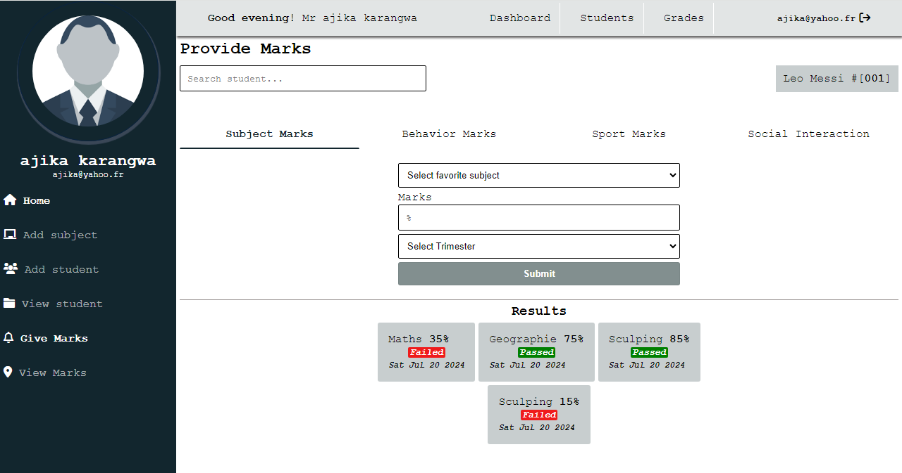

# Student Grading App

This mini-app uses React, Node JS, Express JS, and MongoDB.

## Installation

Clone the repository by ` git clone https://github.com/karangwaajika/react-student-grading.git`

## Usage

- Front-end: React
  - The client side is designed using pure CSS, HTML, and React.
  - You must ensure you have the necessary tools to run a React app.
- Back-end: Node js
  - The server is handled by Node js, more specifically using Express js.
  - Data are stored in MongoDB Atlas Database.

## Contributing

As mentioned above, this repo is for putting what I've been learning into practice.
Therefore, pull requests are welcome to gain more experience from you. <a href="https://react-student-grading.vercel.app/"> A Link to the hosted project</a>
